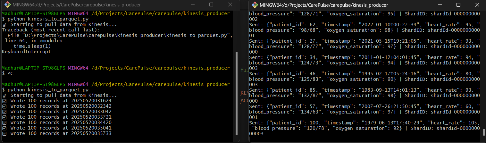

# CarePulse: Healthcare Analytics Pipeline (Batch + Streaming)

## 🩺 Project Overview
CarePulse is an end-to-end data engineering pipeline designed to simulate real-world healthcare analytics. It combines batch and real-time streaming ingestion with slowly changing dimension (SCD) logic, Delta Lake medallion architecture, and KPI generation. This project was built entirely using Databricks Community Edition, Spark, and Power BI, making it fully free and reproducible.

## ⚙️ Tech Stack
- **Apache Spark** (Structured Streaming, DataFrame APIs)
- **Delta Lake** (Bronze, Silver, Gold architecture)
- **Databricks Community Edition** (or any Spark runtime)
- **Kinesis-like simulation** via Python scripts
- **Power BI** (dashboarding)
- **Pandas** for CSV export
- *(Optional)* Snowflake for external data warehouse integration

## 📂 Project Structure
```
carepulse-healthcare-pipeline/
├── README.md
├── databricks_notebooks/
│   └── carepulse_end_to_end_notebook.ipynb
├── kinesis/
│   ├── kinesis_vitals_producer.py
│   └── kinesis_vitals_consumer.py
├── data/
│   ├── patients.csv
│   ├── organizations.csv
├── images/
│   ├── architecture_diagram.png
│   └── powerbi_dashboard.png
├── snowflake_export_code.py 
└── requirements.txt

```

## 🏗️ Architecture Overview
This pipeline is structured using the medallion architecture:

- **Bronze Layer**: Raw ingestion of batch CSVs and simulated real-time vitals
- **Silver Layer**: Cleaned data with SCD Type 2 tracking for `dim_patient` and `dim_hospital`
- **Gold Layer**: Aggregated KPIs per patient

## 🔄 Data Sources
- **Batch**:
  - `patients.csv`, `organizations.csv`
- **Streaming**:
  - Python-based producer simulating vitals (heart rate, BP, etc.) per second

## 🧠 Key Features
- ✅ Batch ingestion of healthcare data (patients, hospitals)
- ✅ Real-time vitals data simulation using Python (Kinesis-style)
- ✅ SCD Type 2 implementation for dimension tables
- ✅ Delta Lake storage and versioning
- ✅ Enriched fact table combining streaming + dimension joins
- ✅ Gold KPIs: heart rate, BP anomalies, hospital visits, high-risk tagging
- ✅ Exported to Power BI for visualization
- ✅ Ready for Snowflake export (optional script provided)

## 📊 Sample KPIs
- `avg_heart_rate`
- `bp_abnormal_count`
- `hospitals_visited`
- `city_change_count`
- `is_high_risk_patient`

## 🚀 How to Run the Project
1. Import the notebook into Databricks CE
2. Upload `patients.csv` and `organizations.csv` into `/FileStore/tables/`
3. Run the `kinesis_vitals_producer.py` script locally
4. Upload generated `.parquet` vitals files to `/mnt/bronze/vitals`
5. Run notebook to process Bronze → Silver → Gold
6. Export `gold_patient_kpis` to CSV for Power BI or Snowflake

## ☁️ Snowflake
A `snowflake_export_code.py` script is provided for pushing gold tables to Snowflake using `write_pandas()`.

## 🖼️ Dashboard
Power BI dashboard includes:
- High-risk patients filter
- Avg heart rate bar charts
- BP risk vs hospital visits scatter plot
  
## Images




## 📝 Author
Madhur Dixit

## 📌 License
MIT License
